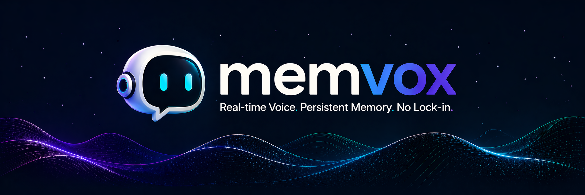

# memvox



A low-latency, streaming voice agent with persistent wiki memory. Phase 1 runs a
full speak-listen loop locally: **mic → VAD → Whisper ASR → LLM → TTS → speaker**.

## Quick start

You need **Python ≥ 3.11** and either a running **Ollama** or **Docker** (the
launcher uses Docker to run Ollama if you don't already have it; both the
`docker compose` v2 plugin and the standalone `docker-compose` v1 binary work).
For the Rust audio binary you also need **Rust/cargo** — if it's missing, the
launcher falls back to a pure-Python audio shim automatically.

```bash
git clone <repo> && cd memvox
./run.sh up
```

### macOS / Apple Silicon: use native Ollama, not Docker

Docker on macOS runs Linux containers inside a VM with **no GPU passthrough**, so
a containerized Ollama is **CPU-only** and throws away your Apple Silicon (Metal)
acceleration — bad for voice latency. Install Ollama natively instead:

```bash
brew install ollama
ollama serve            # or: brew services start ollama
./run.sh up
```

`run.sh` probes `:11434` first and **skips Docker entirely** when a native Ollama
is already serving, so you get Metal acceleration and avoid Compose setup
altogether. (Docker-run Ollama is meant for Linux hosts, ideally with an NVIDIA
GPU — see the GPU overlay below.)

That single command will:

1. create a virtualenv and install Python dependencies,
2. start **Ollama** (reusing a native one on `:11434`, else via Docker — with a
   GPU overlay when an NVIDIA GPU is detected) and pull the model,
3. build & start the **Rust audio** binary (or the shim),
4. start the **orchestrator**.

When it prints `✅ memvox is up`, just **speak into your mic**.

```bash
./run.sh status     # what's running
./run.sh logs       # tail audio + orchestrator logs (Ctrl-C to stop tailing)
./run.sh down       # stop everything the launcher started
```

## Premium voice (Cartesia, optional)

The default skin (`korean_tutor`) is fully local and needs no API keys. For
Cartesia Sonic voices, bring your own key:

```bash
cp .env.example .env        # then edit:
#   CARTESIA_API_KEY=sk_car_...
#   CARTESIA_VOICE_ID=<a voice UUID from https://play.cartesia.ai/>

./run.sh up cartesia_demo
```

The `cartesia_demo` skin is a bilingual Korean tutor: it talks mostly in English
and teaches Korean phrases (rendered slowly so you can repeat them), and you can
say *"let's do Korean only"* to switch to immersion mode mid-conversation.

## Configuration

`run.sh` reads `.env` and these environment variables:

| Variable        | Default            | Purpose                                  |
|-----------------|--------------------|------------------------------------------|
| `MEMVOX_SKIN`   | `korean_tutor`     | Skin to run (or pass as `./run.sh up <skin>`) |
| `OLLAMA_MODEL`  | `exaone3.5:7.8b`   | Model the launcher ensures is pulled     |
| `MEMVOX_AUDIO`  | _(auto)_           | Set to `shim` to force the Python audio shim |

> **Note:** `OLLAMA_MODEL` must match the model the chosen skin expects.

## Manual / advanced

`./run.sh` is just a wrapper. To run pieces by hand, see the per-process docs in
[`ARCHITECTURE.md`](./ARCHITECTURE.md) and the comments in `docker-compose.yml`,
`shim.py`, and `memvox/__main__.py`.
